# tissue_elongation

Assisting with this project:

Cell density couples tissue mechanics to control the elongation speed of the body axis.
 Changqing Lu,  Joana M. N. Vidigueira,  Christopher Chan Jin Jie,  Alicja Maksymiuk,  Fengzhu Xiong, https://doi.org/10.1101/2023.12.31.573670

This is an update to the original project. In particular, it:
* uses PhysiCell 1.13.1 (the original project used 1.7.1)
* just uses the `template` sample project executable (therefore custom.cpp is very different)
* uses PhysiCell Studio
* uses `config/body_cells.csv` for the initial conditions of the cells (rather than the original in setup_tissue())
* uses `config/body_rules.csv` to specify cell rules that prevent unrealistic overcrowding
* many of the original User Parameters are no longer used

We are having ongoing discussions about the original model vs. this updated version.

To get started, one would:
* clone or download a release of this repo
* if you don't have an appropriate g++ compiler installed for PhysiCell, rf. https://github.com/physicell-training/ws2023/blob/main/agenda.md
* run `make` in the root directory to build the `bodyaxis` executable model
* get the latest release of PhysiCell Studio (rf. https://github.com/PhysiCell-Tools/Studio-Guide) and run it with this model, e.g.,
  
  `python studio/bin/studio.py -c config/body_axis.xml -e bodyaxis`

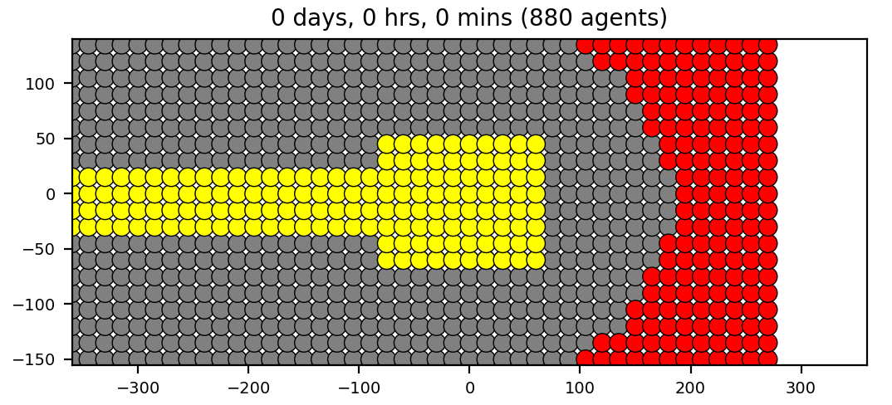

## body_axis0.xml -  cell proliferation and death; default(?) mechanics; no chemotaxis; rules to prevent overcrowding

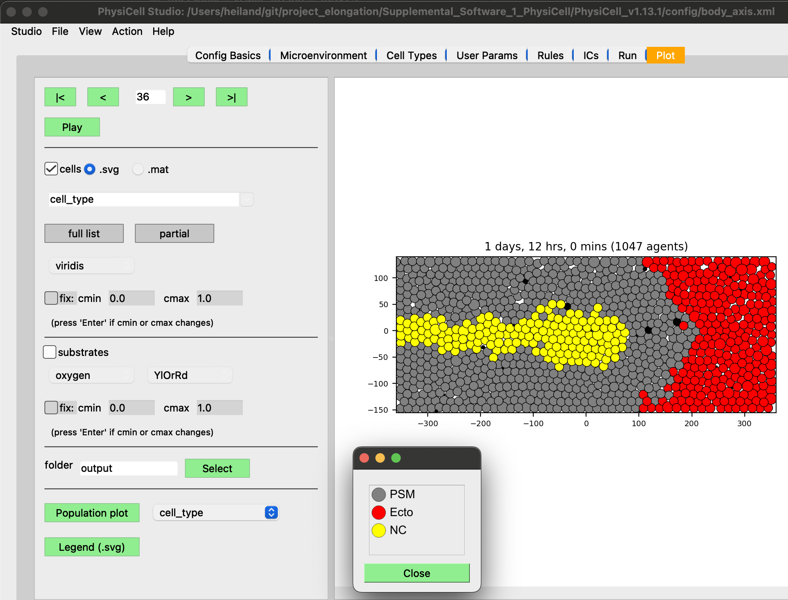

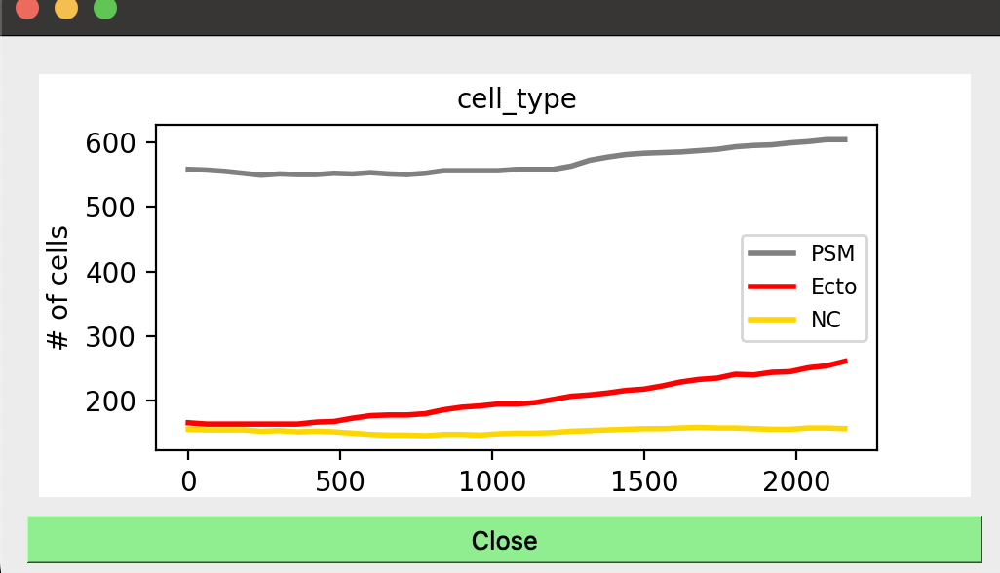

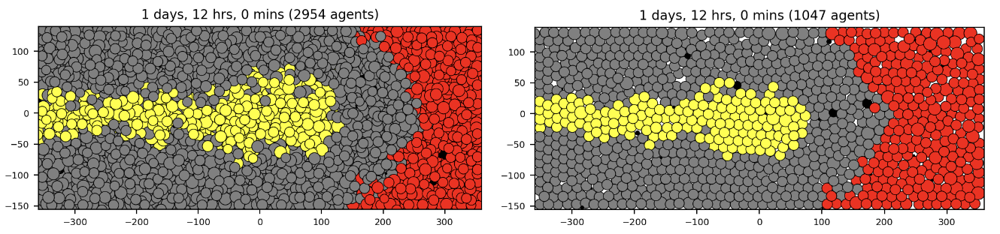Without rules vs. with

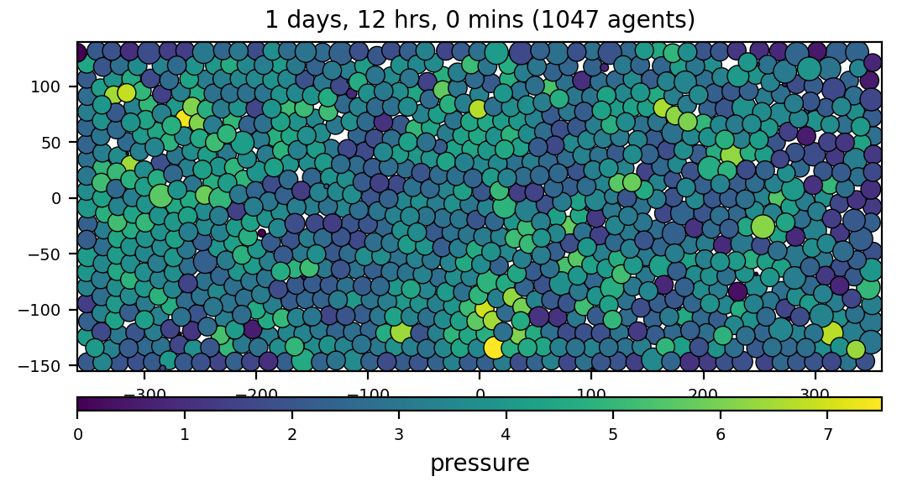

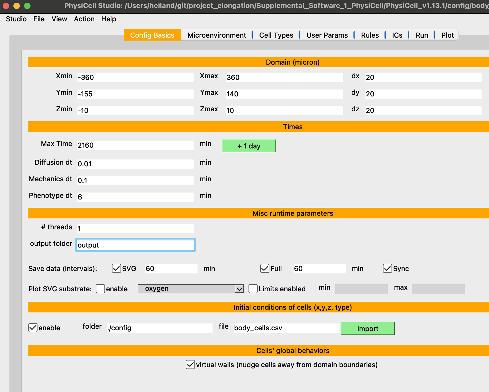

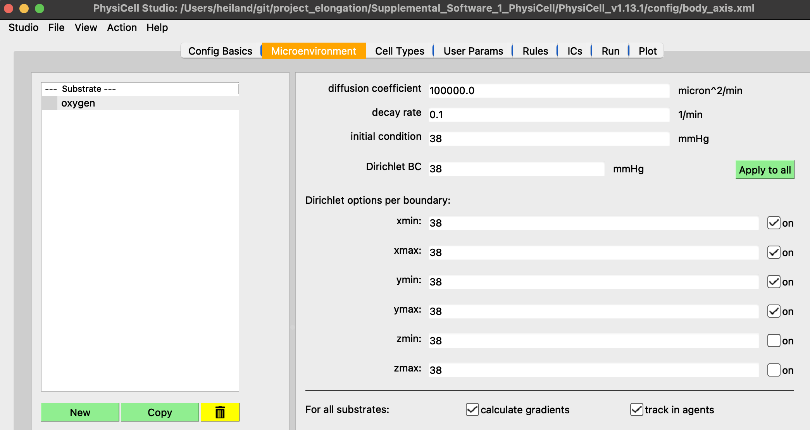
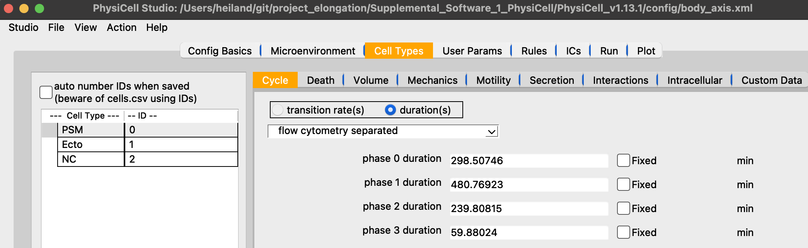
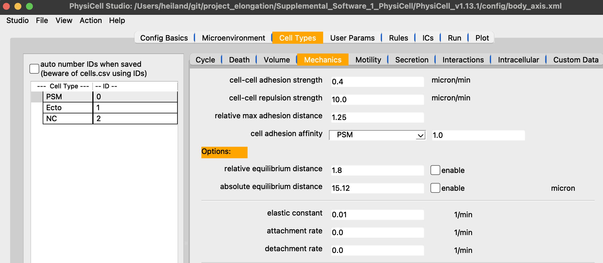
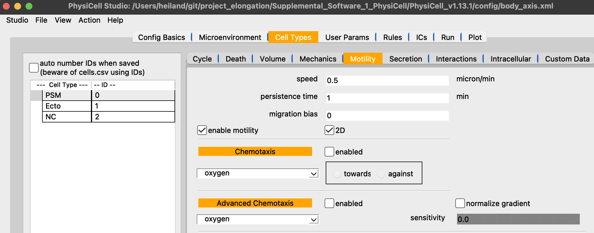
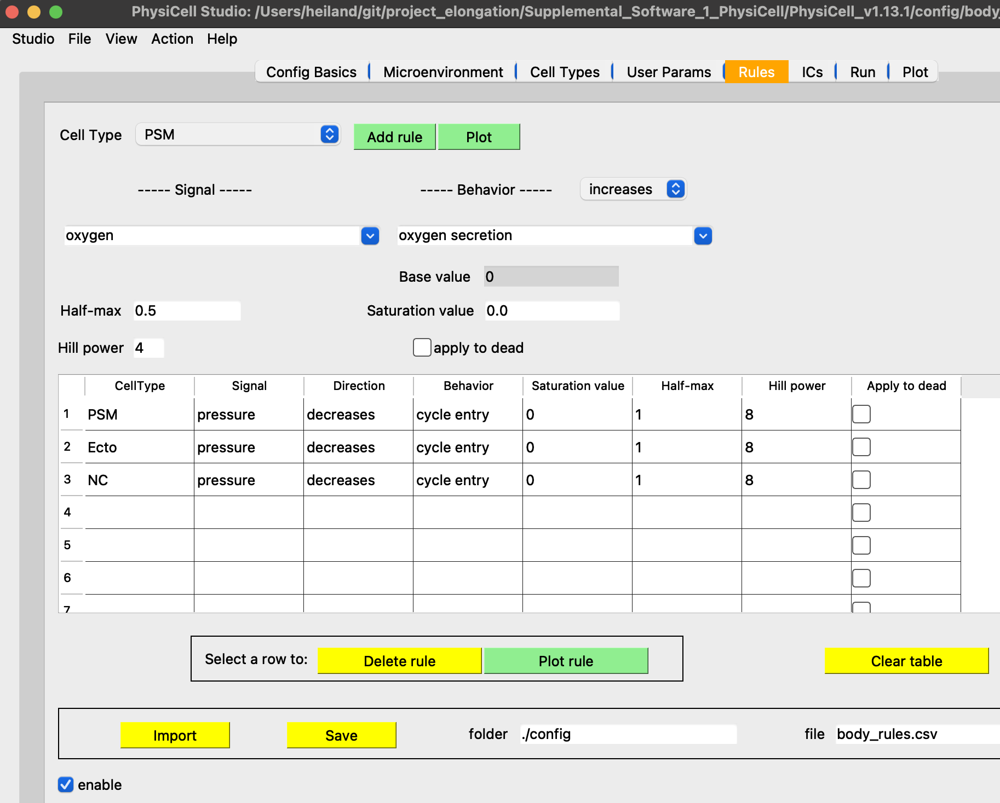
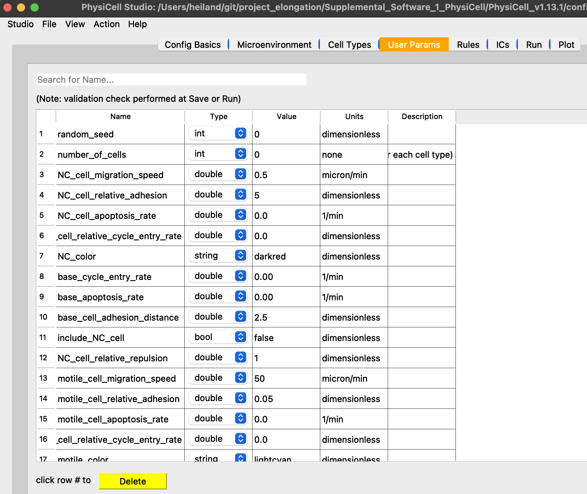

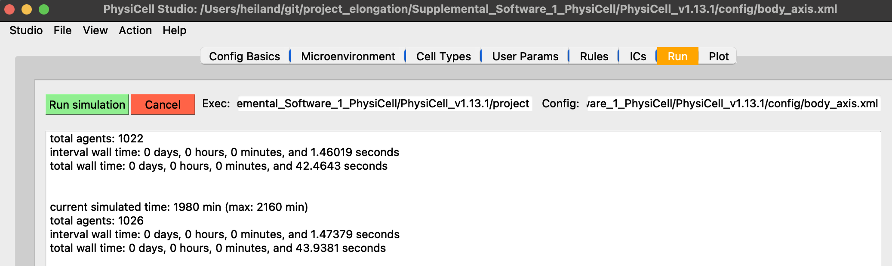

## body_axis1.xml - NC chemotax to a signal being emitted from right boundary (xmax)

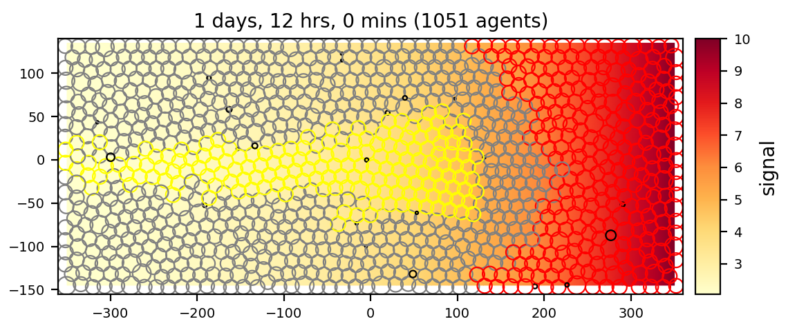

